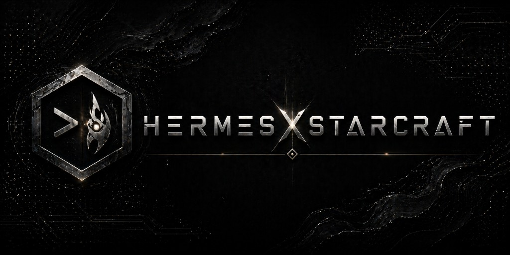

https://github.com/user-attachments/assets/a9c275cb-2a0b-4a3e-8225-9946fe91070e

Hermes x StarCraft adds a StarCraft Remastered operations view to the Hermes dashboard. It renders a live Hermes installation as a StarCraft base after a Remastered-style boot flow, then embeds a modified Titan Reactor/OpenBW renderer as a dashboard tab.

## What It Does

The dashboard reads a local Hermes home directory and turns operational state into StarCraft entities. The identity core becomes the main base, cron jobs become workers, active sessions become combat units, API keys become gas infrastructure, skills become production buildings, and logs/monitoring become defensive or observability structures.

Terran, Zerg, and Protoss use different StarCraft units while preserving the same Hermes roles. Protoss layouts add the minimum needed Pylons so buildings stay powered.

The boot flow loads art dynamically from the user's local StarCraft Remastered install through the CASC HTTP server:

- Splash: `SD\glue\title\title.DDS` via `?png=1`.
- Race selection: `SD\glue\campaign\prot.webm`, `terr.webm`, and `zerg.webm`.
- Loading screen: `SD\glue\palnl\backgnd.DDS` via `?png=1`, with a bottom-centered loading indicator.

## How It Works

Hermes x StarCraft keeps Titan as the renderer but lets Hermes drive the world. The dashboard sends a live list of Hermes-derived entities into the Titan iframe, and Titan spawns, updates, and removes real OpenBW units on the loaded map.

Simple flow:

```text
Hermes files + state.db
  -> HermesStateReader
  -> EntityMapper
  -> bridge WebSocket
  -> dashboard entity store
  -> Titan iframe postMessage
  -> Hermes entity bridge inside Titan
  -> OpenBW units/buildings on the map
```

Key pieces:

- `packages/starcraft-dashboard/`: Hermes state reader, entity mapper, WebSocket bridge, viewer, CASC asset server, and dashboard integration.
- `packages/titan-reactor/src/core/world/`: Hermes bridge, base layout, terrain validation, and low-frequency unit behavior.
- `plugins/hermesxstarcraft/`: dashboard plugin tab that points Hermes at the local viewer.
- `scripts/`: install, plugin registration, and start helpers.

Building support required a small OpenBW/Titan adaptation. Mobile units use OpenBW's normal unit creation path. Buildings use a completed-building creation path so real structures can appear reliably without being blocked by normal melee placement checks during dashboard rendering. Placement validation is still used where possible so edited positions do not crash or overlap obvious invalid terrain.

Edit mode is stored locally in the browser under `hermes.titan.editLayout.v1`. It lets a user select buildings, change their StarCraft type, nudge positions, and reload with those positions preserved. Some building type changes are intentionally applied on reload because live-mutating OpenBW buildings is less stable than recreating the scene cleanly.

## Repository Layout

```text
HermesxStarcraft/
  packages/starcraft-dashboard/   # Hermes state bridge, viewer, CASC HTTP server, dashboard integration
  packages/titan-reactor/         # Titan Reactor/OpenBW renderer with Hermes world bridge
  plugins/hermesxstarcraft/       # Hermes dashboard plugin tab
  scripts/                        # local install/start helpers
  .env.sample                     # copy/edit for local config
  .env                            # local non-secret defaults for this checkout
```

## Setup

Clone with submodules, configure your local StarCraft install, install dependencies, and register the Hermes dashboard plugin:

```bash
git clone --recurse-submodules https://github.com/PhilipAD/HermesxStarcraft.git
cd HermesxStarcraft
cp .env.sample .env
```

Edit `.env` and set `SC_ROOT` to your legally owned StarCraft Remastered install:

```bash
HERMES_HOME=$HOME/.hermes
SC_ROOT="/path/to/your/StarCraft"
CASC_PORT=8080
TITAN_STUB_RUNTIME_PORT=8090
TITAN_STUB_PLUGINS_PORT=8091
```

Install and register the dashboard tab:

```bash
npm run install:all
npm run install:plugin
```

`install:all` applies the `-Wno-narrowing` compiler flag required by the bundled CASC native dependency on newer Linux toolchains. If the checkout path contains shell metacharacters such as parentheses, it installs through a temporary safe path and copies `node_modules` back.

`install:plugin` creates this symlink:

```text
~/.hermes/plugins/hermesxstarcraft -> ./plugins/hermesxstarcraft
```

Restart the Hermes dashboard or rescan dashboard plugins after installing.

Do not put API keys or secrets in this package's `.env`. Hermes credentials stay in the normal Hermes home.

## Requirements

- A working Hermes installation on the same machine.
- A legally owned local installation of StarCraft Remastered.
- Node.js 20 or newer.
- npm.
- Git and Git LFS. The Titan submodule stores required OpenBW runtime artifacts with LFS.
- Native build tools for `bw-casclib` if your platform needs to rebuild the CASC reader.
- A browser with WebGL support. Use `TITAN_WEBGL_COMPAT=1` on VM/llvmpipe systems if needed.

## Legal And Distribution Notes

This package must not include Blizzard game assets. It does not need to ship StarCraft sprites, sounds, maps, MPQ/CASC archives, or copied game installation files. At runtime, the CASC HTTP server reads assets from the user's own StarCraft Remastered installation pointed to by `SC_ROOT`.

Users must own a valid copy of StarCraft Remastered. This project is not affiliated with, endorsed by, sponsored by, or approved by Blizzard Entertainment. StarCraft and Blizzard Entertainment are trademarks or registered trademarks of Blizzard Entertainment, Inc.

This package references a modified Titan Reactor fork as a Git submodule. Titan Reactor is an OpenBW 2.5D StarCraft map and replay viewer; the upstream README also states that it requires a purchased copy of StarCraft Remastered and uses an asset server that reads from the local StarCraft install. See the upstream project: <https://github.com/alexpineda/titan-reactor> and the Hermes fork: <https://github.com/PhilipAD/titan-reactor-1>.

See `THIRD_PARTY_NOTICES.md` for third-party attribution notes.

Titan/OpenBW runtime binaries needed by this integration are committed in the Titan submodule via Git LFS. If you edit and rebuild OpenBW/Titan, commit refreshed runtime artifacts such as `bundled/titan.wasm` and `src/openbw/titan.wasm.js` to the Titan fork with Git LFS. Do not commit StarCraft install files, extracted CASC data, maps, sprites, sounds, screenshots, or local logs.

## Run

```bash
npm run start
```

Open the Hermes dashboard and choose the `Hermes x StarCraft` tab, or use the direct local view:

```text
http://127.0.0.1:9120/?titan=1
```

Default ports:

- `9120`: Hermes x StarCraft dashboard viewer
- `9121`: Hermes bridge API/WebSocket
- `3344`: Titan/OpenBW renderer
- `8080`: StarCraft CASC asset HTTP server
- `8090`: Titan runtime stub
- `8091`: Titan plugin stub

Expected startup output includes the bridge on `9121`, viewer on `9120`, Titan on `3344`, and CASC server on `8080`. If the iframe is blank, first confirm `SC_ROOT` points at a valid StarCraft Remastered install and that `packages/titan-reactor/src/openbw/titan.wasm.js` is not a Git LFS pointer.

## Configuration Reference

- `HERMES_HOME`: Hermes data directory. Default: `~/.hermes`.
- `SC_ROOT`: required path to StarCraft Remastered.
- `TITAN_ROOT`: optional override for the Titan renderer. Default: `./packages/titan-reactor`.
- `CASC_PORT`: CASC asset HTTP port. Default: `8080`.
- `TITAN_STUB_RUNTIME_PORT`: runtime stub port. Default: `8090`.
- `TITAN_STUB_PLUGINS_PORT`: plugin stub port. Default: `8091`.
- `TITAN_WEBGL_COMPAT=1`: optional safer WebGL mode for VMs.

## What Not To Commit

The package is intended to exclude:

- `node_modules/`
- build outputs such as `dist/`
- local env/generated files, except `.env.sample`
- `packages/titan-reactor/.env.development.local`
- `packages/starcraft-dashboard/starcraft-install.path`
- StarCraft game assets or install files
- extracted analysis output from `packages/starcraft-dashboard/analysis/`
- exported CASC samples or Remastered target dumps
- binary game asset formats such as `.dds`, `.pcx`, `.grp`, `.smk`, `.mpq`, and `.casc`
- screenshots, local logs, caches, and Playwright output

